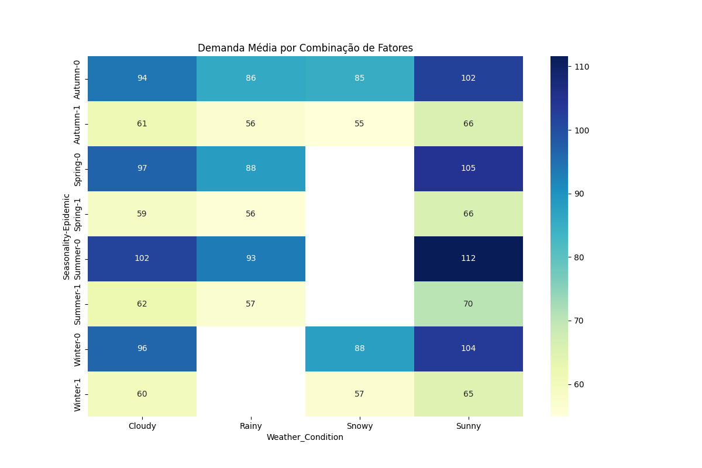
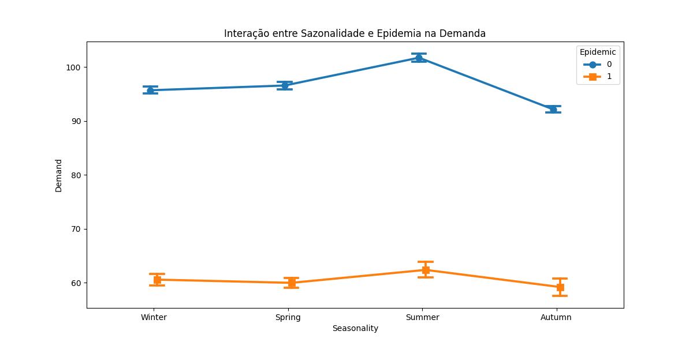

## Existe interação significativa entre Seasonality, Weather Condition e Epidemic na variação do Demand? Caso sim, quais combinações de fatores geram maior ou menor demanda?

#### Resumo da Resposta
Há interação significativa. A maior demanda ocorre sem epidemia, com tempo ensolarado, especialmente no verão. A menor demanda ocorre com epidemia e clima ruim (neve/chuva), como no outono com neve.

#### Metodologia
Foi utilizada ANOVA e regressão linear com interações triplas entre Sazonalidade, Clima e Epidemia, além de controles para categoria, região e promoções. Visualizações de médias e heatmaps foram geradas.

#### Principais Resultados
- Epidemia reduz fortemente a demanda.
- Verão, clima ensolarado e ausência de epidemia maximizam a demanda (~112).
- Outono, epidemia e neve minimizam a demanda (~55).
- Interações são estatisticamente significativas.

#### Visualizações
- 
- 

#### Discussão
Os gráficos e o modelo confirmam a importância das interações. A epidemia é o fator isolado de maior impacto negativo. Limitações incluem multicolinearidade e possíveis efeitos não capturados por variáveis externas.